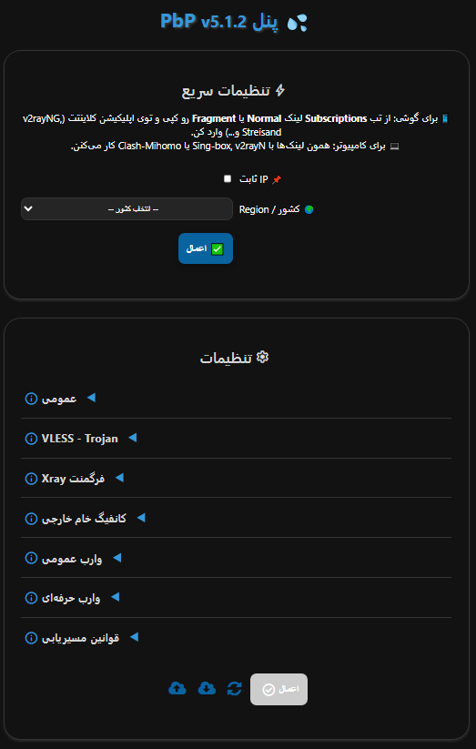
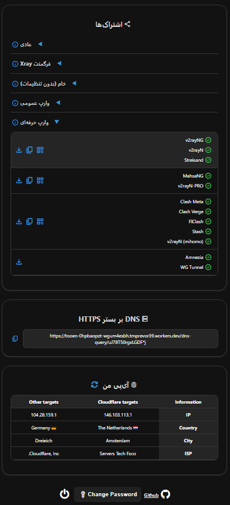

<h1 align="center">پنل PbP</h1>

 
## معرفی

این پروژه یک پنل کاربری برای دسترسی به کانفیگ‌های رایگان، امن و خصوصی **VLESS**، **Trojan** و **Warp** و همچنین یک سرور **DoH** خصوصی ارائه می‌دهد. حتی زمانی که دامنه‌ها یا سرویس‌های Warp توسط ISP مسدود شوند، اتصال را تضمین می‌کند و دو روش دیپلوی ارائه می‌دهد:

- دیپلوی **Workers**
- دیپلوی **Pages**

## ویژگی‌ها

1. **رایگان و خصوصی:** بدون هزینه و سرور کاملاً خصوصی
2. **پنل کاربرپسند:** ناوبری، پیکربندی و استفاده ساده
3. **پروتکل‌های متنوع:** VLESS، Trojan و Wireguard (Warp)
4. **DoH خصوصی:** سرور DoH آماده استفاده با امکان تنظیم DNS زیرین
5. **کانفیگ‌های Warp Pro:** بهینه‌شده برای شرایط حساس
6. **پشتیبانی از Fragment:** برای شرایط شبکه‌ای بحرانی
7. **قوانین مسیریابی جامع:** دور زدن ایران/چین/روسیه، بلاک QUIC، پورن، تبلیغات، بدافزار، فیشینگ و دور زدن تحریم‌ها
8. **پروکسی زنجیره‌ای:** امکان افزودن یک پروکسی زنجیره‌ای (VLESS، Trojan، Shadowsocks، socks و http) برای ثابت کردن IP
9. **سازگاری گسترده با کلاینت‌ها:** لینک اشتراک برای هسته‌های Xray، Sing-box و Clash-Mihomo
10. **پنل رمزدار:** پنل امن و خصوصی با محافظت رمز عبور
11. **کاملاً قابل تنظیم:** تنظیم دامنه‌های IP تمیز، Proxy IP، سرورهای DNS، انتخاب پورت‌ها و پروتکل‌ها، اندپوینت‌های Warp و موارد دیگر

## محدودیت‌ها

1. **ترافیک UDP:** پروتکل‌های VLESS و Trojan روی Workers، UDP را درست هندل نمی‌کنند، پس به‌طور پیش‌فرض غیرفعال است (روی قابلیت‌هایی مثل تماس ویدیویی تلگرام تأثیر می‌گذارد)؛ DNS از نوع UDP هم پشتیبانی نمی‌شود. DoH به‌طور پیش‌فرض برای امنیت بیشتر فعال است.
2. **محدودیت درخواست:** هر ورکر روزانه ۱۰۰ هزار درخواست برای VLESS و Trojan پشتیبانی می‌کند که برای ۲ تا ۳ کاربر مناسب است. کانفیگ‌های Warp محدودیت ندارند.

## شروع کار

- [روش‌های نصب](https://bia-pain-bache.github.io/PbP-Worker-Panel/installation/wizard/)
- [پیکربندی](https://bia-pain-bache.github.io/PbP-Worker-Panel/configuration/)
- [نحوه استفاده](https://bia-pain-bache.github.io/PbP-Worker-Panel/usage/)
- [سوالات متداول](https://bia-pain-bache.github.io/PbP-Worker-Panel/faq/)

## کلاینت‌های پشتیبانی‌شده

| کلاینت | حداقل نسخه | پشتیبانی Fragment | پشتیبانی Warp Pro |
| :---: | :---: | :---: | :---: |
| **v2rayNG** | 2.2.3 | ✔️ | ✔️ |
| **MahsaNG** | 16 | ✔️ | ✔️ |
| **v2rayN** | 7.22.5 | ✔️ | ✔️ |
| **v2rayN-PRO** | 1.9 | ✔️ | ✔️ |
| **Sing-box** | 1.12.0 | ✔️ | ❌ |
| **Streisand** | 1.6.71 | ✔️ | ✔️ |
| **Clash Meta** | — | ❌ | ✔️ |
| **Clash Verge Rev** | — | ❌ | ✔️ |
| **FLClash** | — | ❌ | ✔️ |
| **AmneziaVPN** | — | ❌ | ✔️ |
| **WG Tunnel** | — | ❌ | ✔️ |

## متغیرهای محیطی

| متغیر | کاربرد | اجباری |
| :---: | :---: | :---: |
| **UUID** | UUID مربوط به VLESS | ✔️ |
| **TR_PASS** | رمز عبور Trojan | ✔️ |
| **PROXY_IP** | IP یا دامنه پروکسی (VLESS، Trojan) | ❌ |
| **PREFIX** | پیشوندهای NAT64 (VLESS، Trojan) | ❌ |
| **SUB_PATH** | مسیر URI اشتراک‌ها | ❌ |
| **FALLBACK** | دامنه فال‌بک (VLESS، Trojan) | ❌ |
| **DOH_URL** | آدرس هسته DoH | ❌ |

---
